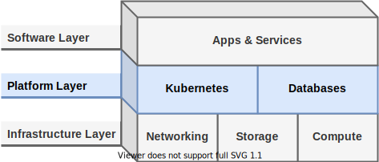

# Platform Layer

This layer provides the environment and runtimes which applications and services are deployed on. In other words, it provides the Kubernetes clusters and database management systems consumed by the software layer.



## Terraform

As with the infrastructure layer, virtual machines are intially provisioned on Proxmox using Terraform. The base Terraform configuration files are symlinked to the infrastructure layer.

VMs can be provisioned using `terraform apply`.

```
cd ./platform-layer/terraform
terraform apply
```

The `-target` option can also be added to limit the scope of the `apply`. This can be useful when needing to apply changes to a subset of resource at a time. For example, when changing K8s nodes.

```
cd ./platform-layer/terraform
terraform apply -target=-k3s-prod[0] -target=k3s-prod[1]
```

## Ansible

Much like the Terraform files in this layer, Ansible playbooks which apply base configurations are symlinked to the infrastructure layer.

A main.yaml playbook is provided to upgrade installed packages and apply all base configurations. It can be used against staging environment hosts as follows.

```
cd ./platform-layer/ansible/
ansible-playbook -i inventory/ playbooks/main.yaml -K
```

To then configure a K3s cluster on the nodes, use the playbook provided by k3s-ansible.

```
ansible-playbook -i inventory/ k3s-ansible/site.yml -K
```
