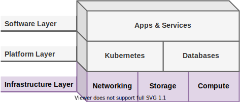

# Infrastructure Layer

This layer provides the hypervisors, bare-metal operating systems, and compute resources used by the platform layer.

## Compute

Compute resources are provided using the following hardware:

|Qty.|Model|CPU|Memory|Storage|Usage|
|----|-----|---|------|-------|-----|
|5|Lenovo ThinkCentre M910q|Intel i7-7700T 4 Cores, 8 Threads|16GB DDR4|512GB SSD|Proxmox VE|
|2|Raspberry Pi 4 Model B+|ARM v8 Cortex-A72 4 Cores|8GB LPDDR4|32GB SD Card|K3s|
|2|Raspberry Pi 4 Model B+|ARM v8 Cortex-A72 4 Cores|4GB LPDDR4|32GB SD Card|K3s|

## Storage

All bare-metal and VM workloads run off directly attached disks. For other bulk data storage needs, a [Synology DiskStation DS920+](https://www.synology.com/en-us/products/DS920+) NAS is used. Currently the following disks are installed in a Synology Hybrid Raid (SHR) array, providing about [12TB of available storage](https://www.synology.com/en-us/support/RAID_calculator?hdds=6%20TB|6%20TB|3%20TB|3%20TB).

|Qty.|Series|Model #|Interface|Capacity|
|----|------|-------|---------|--------|
|2|Seagate Iron Wolf|ST6000V001-2BB186|SATA|6TB|
|1|Seagate Barracuda|ST3000DM001-1CH166|SATA|3TB|
|1|Western Digital Green|WD30EZRX-00DC0B0|SATA|3TB|

### Backups

Where possible, encrypted backups are saved to the NAS using [Duplicati](https://www.duplicati.com/) installed on each host. The NAS then syncs the backups to a cloud storage provider.

This satisfies the 3-2-1 rule since there are always 3 copies of the data: one on the source, one on the NAS, and another in the cloud. It is always on at least 2 different media, and 1 copy is always offsite.

## Networking

|Qty.|Model|CPU|Memory|Storage|Usage|
|------|-------|-----|--------|---------|-------|
|1|Netgate SG-3100|ARM v7 Cortex-A9 2 Cores @ 1.6GHz|2GB DDR4L|32 GB M.2 SATA SSD|Firewall/Router|
|1|UniFi FlexHD|---|---|---|Wi-Fi|
|3|UniFi USW-8|---|---|---|Switching|
|2|UniFi USW Flex|---|---|---|Switching (RPis)|

## Power

Power to all equipment is provided by the following two UPSes.

|Qty.|Model|Volt-ampere|Watts|
|----|-----|-----------|-----|
|1|CyberPower CP1500PFCLCD|1500VA|1000W|
|1|CyberPower OR700LCDRM1U|700VA|400W|

To help prevent a single UPS failure from becoming a single point of failure, clustered and highly available components are always powered by different UPSes. However, since many clusters (including Proxmox VE and Kubernetes) require an odd number of nodes to maintain quorum, a single UPS failure might still be problematic depending on which UPS fails. Both UPSes are also plugged into the same electrical circuit so a breaker trip or other problem would cause power loss to both UPSes.

These problems are currently accepted as compromises for using small form-factor, low-power, consumer hardware which often don't have redundant power supplies or NICs.
